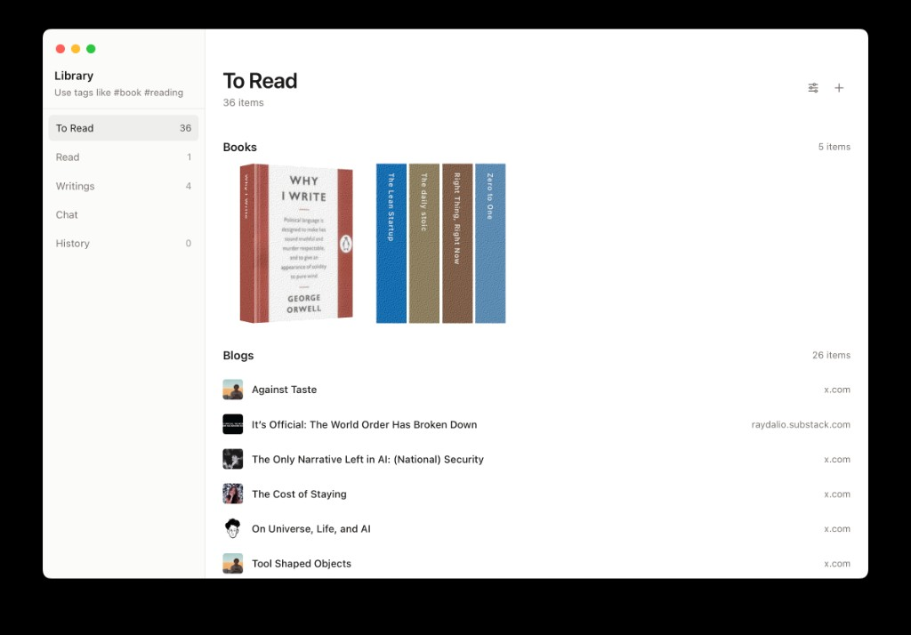
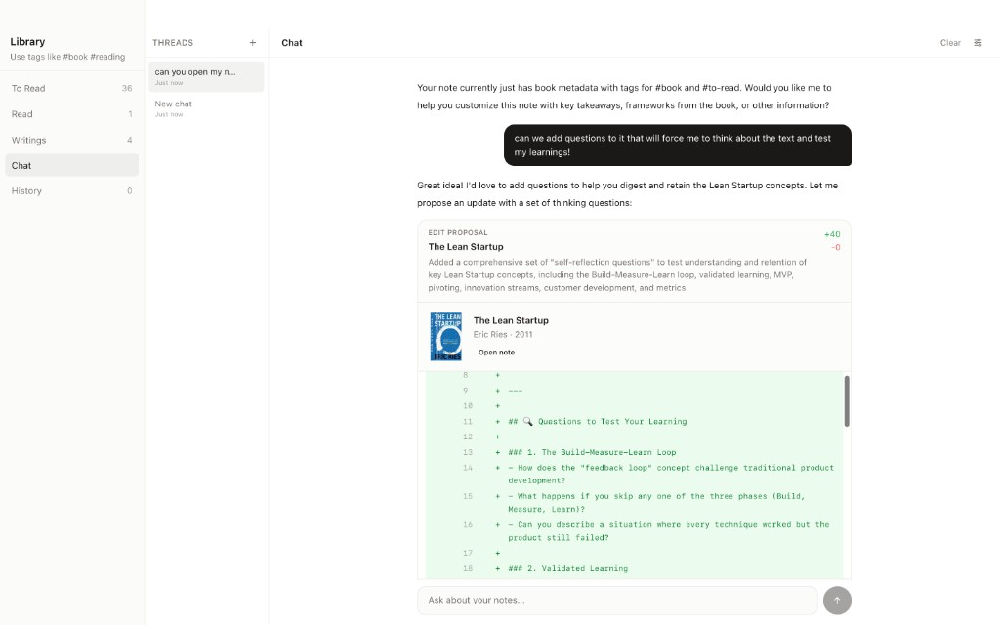
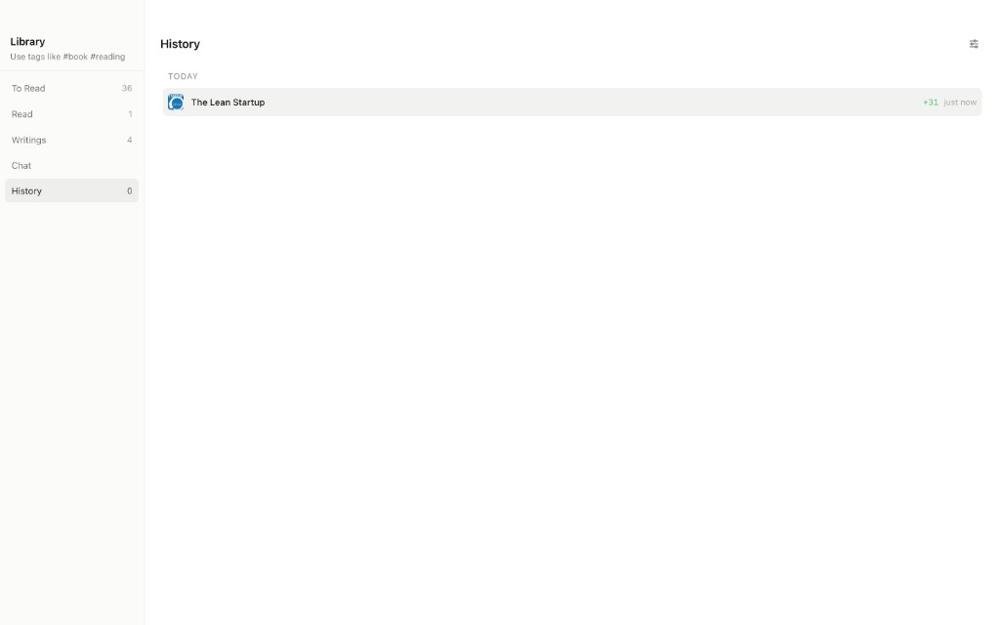
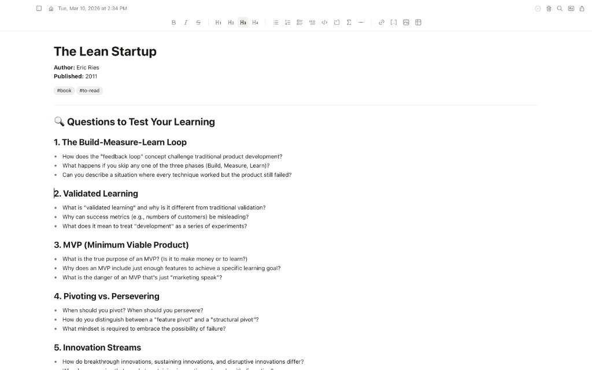

# cf_ai_shayaan_azeem_think

ai powered local first markdown notes app with cloudflare chat agent integration.

1. prompt history reference: @PROMPTS.md
2. assignment reference: [agents.cloudflare.com](https://agents.cloudflare.com/)

## run

```bash
# repo root
npm install
npm run tauri dev
```

```bash
# chat agent
cd workers/chat
cd agent
npm install
npm run dev      # local
npm run deploy   # production
```

after deploy or local dev, paste worker url in think:
`settings to general to chat agent to chatworkerurl`

## screenshots






## what it does

1. local markdown notes create read update delete in user selected folder
2. tantivy full text search in rust
3. tiptap editor with markdown tables code mermaid and slash commands
4. file watcher plus autosave
5. ai chat over notes with retrieval and safe edit proposals

## cloudflare stack used

1. llm: workers ai using glm 4.7 flash model in worker server
2. workflow and coordination: worker plus durable object chatagent
3. user input: text chat ui in app
4. memory and state:
   1. chat thread state in durable objects
   2. note state in local markdown plus app contexts

## ai tool flow

1. `searchnotes(query)` finds relevant notes
2. `readnote(noteid)` fetches full note content
3. `proposenoteedit(noteid, updatedcontent, summary?)` generates reviewable diff
4. user approves before write to disk

## key decisions

1. tauri plus rust for local performance and low overhead
2. cloudflare worker as centralized agent runtime
3. durable objects for per thread continuity
4. proposal first edits for safety and auditability

## repo structure

1. `src/` react frontend
2. `src tauri/` rust tauri backend
3. `workers/chat/agent/` cloudflare worker plus durable object

key files:

1. `workers chat agent src server.ts`
2. `workers chat agent wrangler.jsonc`
3. `src components chat chatview.tsx`
4. `src components chat chattools.ts`
5. `src components settings generalsettingssection.tsx`

